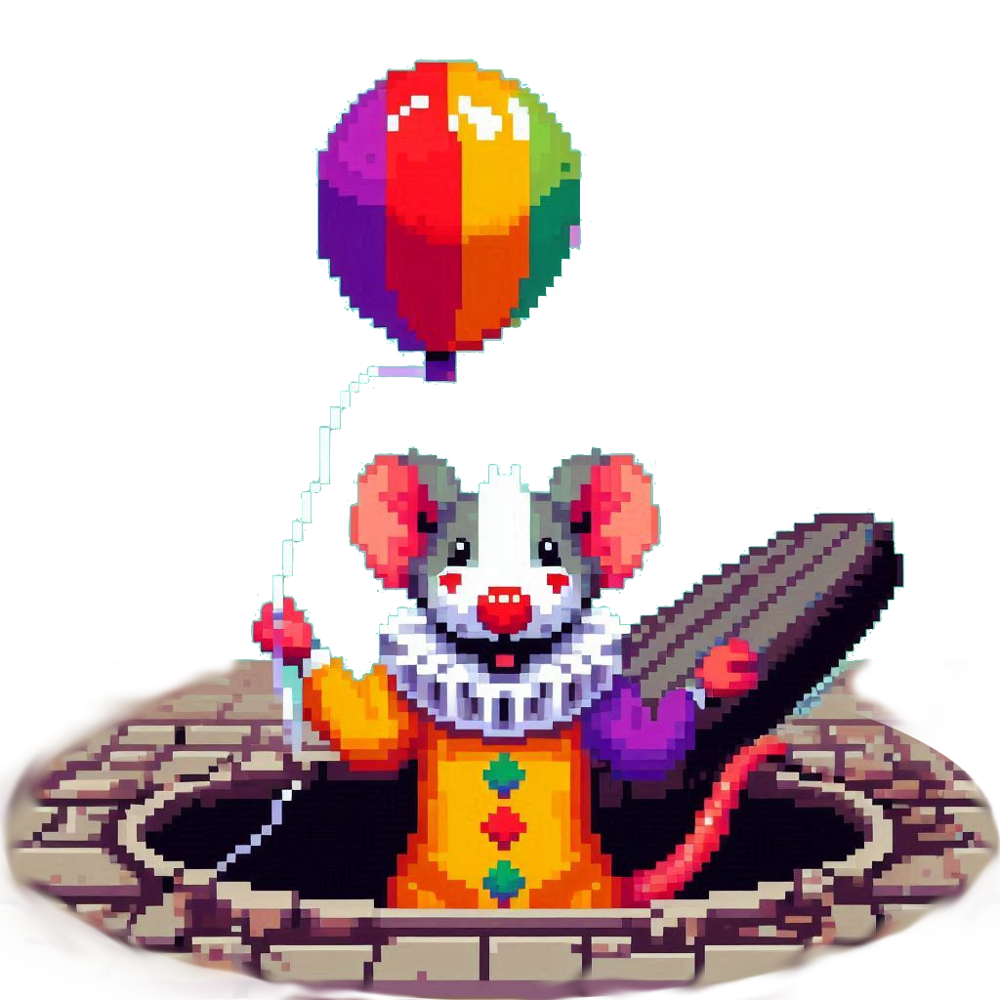
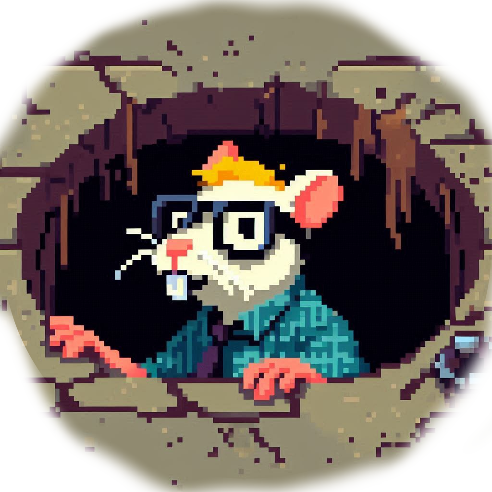
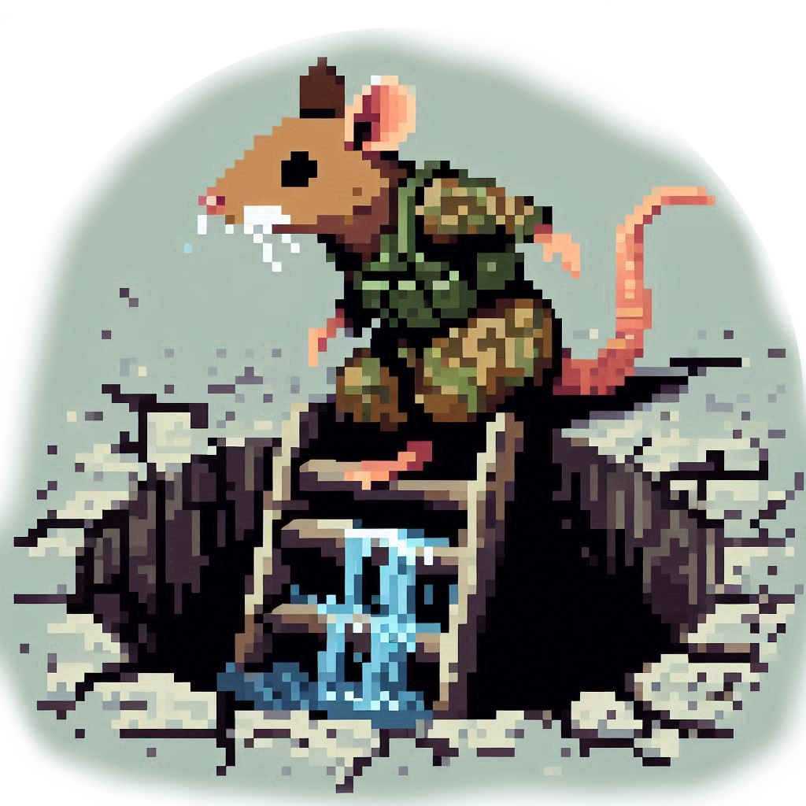
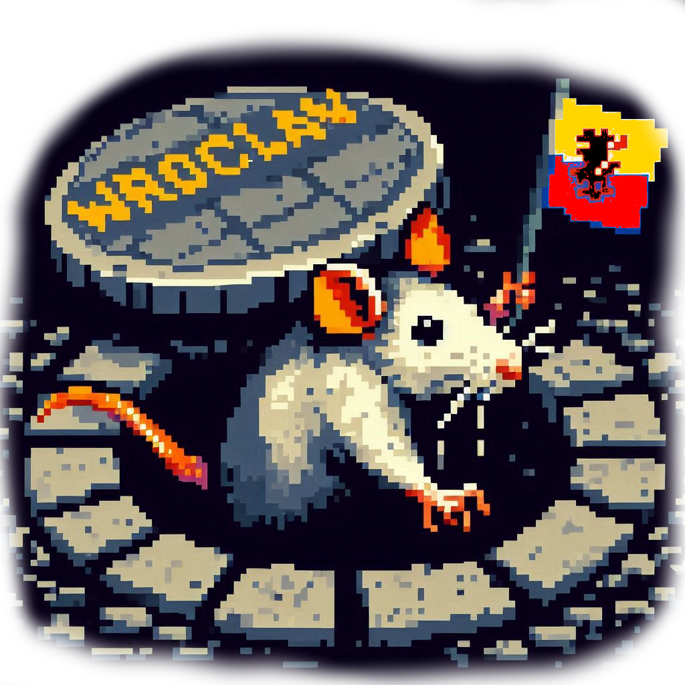

# Whac-a-Rat

*Gra dla prawdziwych szczurołapów*

## Opis gry

### Gra w pigułce

Gra *Whac-a-Rat* jest wzorowana na popularnej grze typu arcade *Whac-a-Mole* (patrz [Wikipedia](https://en.wikipedia.org/wiki/Whac-A-Mole)). Gra testuje refleks gracza, którego zadaniem jest trafienie wychodzących ze studzienek szczurów. 

### Mechanika

Gra składa się z "planszy", na której w wyznaczonych miejscach pojawiają się szczury - cel gracza. Gracz próbuje uderzyć szczura bronią w czasie, kiedy jest na powierzchni. Jeżeli zdąży przed ucieczką szczura - dostaje punkty. Szczury pojawiają się i znikają w losowych odstępach czasu.

Dodatkowym utrudnieniem jest różnorodność szczurów i broni. Każdy z kilku rodzajów szczura ma swoje mocne i słabe strony - w zależności od wybranej broni szczurowi zadaje się mniej lub więcej obrażeń.
Chybione uderzenie zabiera staminę - brak staminy oznacza przegraną. Niektóre szczury są agresywne i mogą losowo zaatakować gracza - gdy życie gracza spadnie do zera, gracz przegrywa.

Gra będzie wyposażona w menu oraz tabelę najlepszych wyników. 

#### Wybór broni, gatunki szczurów

Dostępne są następujące bronie, które najlepiej działają na podane gatunki szczurów:

- But (shoe): Stupid rat, Nerd rat
- Kij bejsbolowy (baseball bat): Stupid rat, Breslau rat
- Pistolet (gun): Military rat

Szczury:

|                                 Stupid                                 |                               Nerd                               |                                   Military                                   |                                  Breslau                                  |
|:----------------------------------------------------------------------:|:----------------------------------------------------------------:|:----------------------------------------------------------------------------:|:-------------------------------------------------------------------------:|
|  |  |  |  |

#### Leaderboard

Gra wyposażona jest w tabele 10. najlepszych wyników. Podczas rozwoju gry zdecydowałem się, żeby zapisywać wszystkie uzyskane wyniki, a wyświetlać tylko 10 najlepszych. Plik z wynikami nie zajmuje dużo miejsca, a gracz może sprawdzić jak polepszał (lub pogarszał!) się z czasem :)

Aby wyjść z leaderboard'a wystarczy nacisnąć klawisz "Q".
